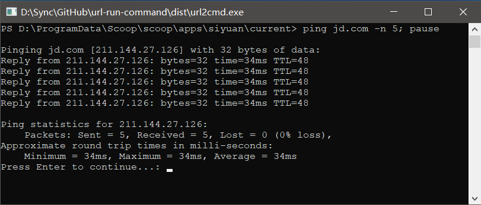

# url-run-command

<center>


</center>

使用 URL 协议运行命令(Run the command using URL protocol)

---

## 原理 | PRINCIPLE

- 将自定义 URL 协议注册为 Windows 系统协议, 并调用一个具有如下功能的程序  
  Register the custom URL protocol as a Windows system protocol and call a program that has the following features.
  1. 对 URL 载荷进行 URL 解码, 获得指令  
     Decode the URL payload to get commands.
  2. 调用系统命令行解析器 `CMD` 或 `PowerShell` 运行指令  
     Call the system command line parser `CMD` or `PowerShell` to run the commands.

**注意**: 为了避免可能出现的 [远程命令/代码执行(Remote Command/Code Execution, RCE)](https://en.wikipedia.org/w/index.php?title=Remote_code_execution&redirect=no) 攻击, 请尽量使用足够长的随机字符串作为自定义协议名称  
**Note**: To avoid possible [RCE(Remote Command/Code Execution)](https://en.wikipedia.org/w/index.php?title=Remote_code_execution&redirect=no) attacks, try to use random strings long enough as custom URL scheme name.

## 开始 | START

### 快速开始 | QUICK START

1. 从 [Releases](https://github.com/Zuoqiu-Yingyi/url-run-command/releases) 中下载发行包并解压到自定义安装目录  
   Download the release package from [Releases](https://github.com/Zuoqiu-Yingyi/url-run-command/releases) and unzip it to a custom installation directory.
2. 运行安装目录中的 `install.bat` 批处理文件  
   Run the `install.bat` batch file in your installation directory.
3. 安装目录中将生成 `insert.reg` 与 `delete.reg` 两个注册表文件  
   `insert.reg` and `delete.reg` registry files are generated in the installation directory.
   - `insert.reg`: 安装时将要写入注册表的注册表项  
     `insert.reg`: The registry key that will be written to the registry at installation time.
   - `delete.reg`: 卸载时将要从注册表中删除的注册表项  
     `delete.reg`: The registry key that will be removed from the registry when uninstalled.
4. 允许对注册表的更改  
   Allow to change the registry.
5. 安装完成  
   The installation is complete.
6. 在 *Windows 资源管理器* 的地址栏中输入 `runcmd://systeminfo; pause;` 或 `runcmd:systeminfo; pause;` 并回车, 检查 URL 协议 `runcmd` 能否运行命令 `systeminfo; pause;` (查看系统信息后暂停)  
   Enter `runcmd://systeminfo; pause;` or `runcmd:systeminfo; pause;` in the address bar of Windows Explorer and enter to check if the URL scheme `runcmd` can run command `systeminfo; pause;` (pause after viewing system information).
7. 点击下方链接, 检查浏览器链接能否使用 `runcmd` 协议运行命令 `systeminfo; pause;`  
   Click on links below to check if the browser link can run command `systeminfo; pause;`   using the `runcmd` protocol.
   - [runcmd://systeminfo; pause;](https://diamondyuan.github.io/302/?location=runcmd%3A%2F%2Fsysteminfo%3B+pause%3B)
   - [runcmd:systeminfo; pause;](https://diamondyuan.github.io/302/?location=runcmd%3Asysteminfo%3B+pause%3B)

## 预览 | PREVIEW



### 高级选项 | ADVANCED OPTIONS

在安装目录中使用如下命令查看命令行参数  
Use the following command in the installation directory to view command line parameters.

```powershell
PS > .\url2cmd.exe help
Active code page: 65001
SYNOPSIS
        url2cmd.exe <url> (-c|-p) [--debug] [--parser <path>]
        url2cmd.exe init [-n <scheme>] (-c|-p) [--debug] [--parser <path>]
        url2cmd.exe help

OPTIONS
        <url>       统一资源定位符 / Uniform Resource Locator, URL
        -c, --cmd   使用 CMD 解析器 / use CMD parser
        -p, --powershell, --pwsh
                    使用 PowerShell 解析器 / use PowerShell parser

        --debug     输出调试信息 / output debug information
        --parser    自定义命令解析器 / custom command parser
        <path>      自定义命令解析器路径 / path of custom command parser
        init        初始化注册表文件 / initialize the registry file
        -n, --name  自定义 URL 协议名称 / custom URL scheme name
        <scheme>    协议自定义名称 / name of custom scheme
        -c, --cmd   使用 CMD 解析器 / use CMD parser
        -p, --powershell, --pwsh
                    使用 PowerShell 解析器 / use PowerShell parser

        --debug     输出调试信息 / output debug information
        --parser    自定义命令解析器 / custom command parser
        <path>      自定义命令解析器路径 / path of custom command parser
        help        查看参数指南 / view the parameter guide
```

### 开发者选项 | DEVELOPER OPTIONS

```powershell
git clone https://github.com/Zuoqiu-Yingyi/url-run-command.git

cd url-run-command

g++ \
   src\main.cpp \
   -o dist\url2cmd \
   -g \
   -static

cd dist

.\url2cmd.exe init \
   --name "<自定义 URL 协议名 | name for custom URL scheme>" \
   --powershell \
   --parser "<自定义命令解析器路径 | path for custom command parser>"

start .\insert.reg
```

## 卸载 | UNINSTALL

1. 运行安装目录中的 `uninstall.bat` 批处理文件  
   Run the `uninstall.bat` batch file in your installation directory.
2. 允许对注册表的更改  
   Allow to change the registry.
3. 卸载完成  
   The uninstall is complete.

## 依赖 | DEPENDENCE

### 源码 | SOURCE

- [muellan/clipp: easy to use, powerful &amp; expressive command line argument parsing for modern C++ / single header / usage &amp; doc generation](https://github.com/muellan/clipp#overview)*[MIT License](https://github.com/muellan/clipp/blob/master/LICENSE)*

## 更改日志 | CHANGE LOG

[CHANGE LOG](./CHANGELOG.md)
